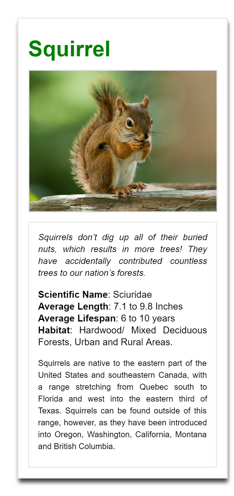

[Link to Live Project](https://vasudevapitta.github.io/Animal-Trading-Card/)
# Animal-Trading-Card
Animal Trading Card - Google Nanodegree - Front End Web Developer Program

The project was to convert a mockup design into a functionality page using HTML5 and CSS3.
The project requirement was to ensure that the functional page exactly replicates the style and design of the mockup.

